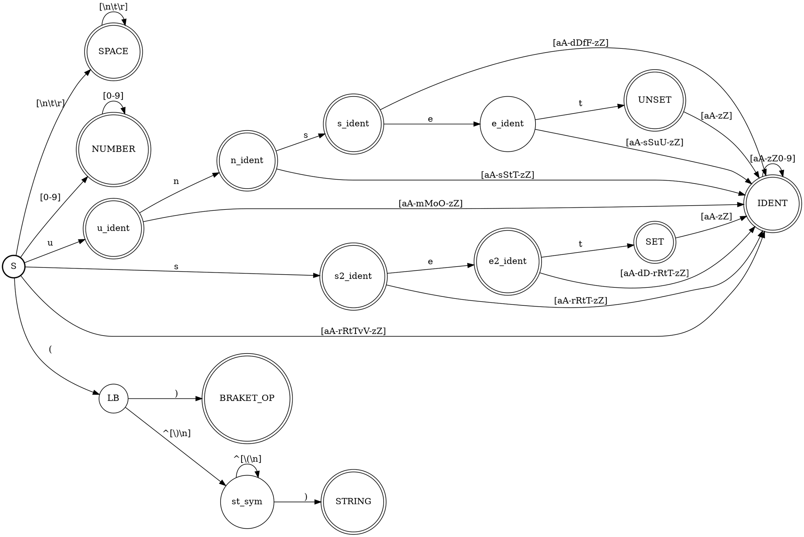

% Лабораторная работа № 1.4 «Лексический распознаватель»
% 24 апреля 2024 г.
% Алексей Митрошкин, ИУ9-31Б

# Цель работы
Целью данной работы является изучение использования детерминированных конечных автоматов
с размеченными заключительными состояниями
(лексических распознавателей) для решения задачи лексического анализа.

# Индивидуальный вариант
set, unset, (), строковые литералы начинаются с (, заканчиваются на ),
не могут содержать внутри круглые скобки и не могут пересекать границы строк текста.
# Реализация

Лексическая структура языка — регулярные выражения для доменов:

* …
IDENT : [aA-zZ][aA-zZ0-9]*
NUMBER: [0-9]+
SPACE : [\\t\\r]+
SET : set
UNSET: unset
BRACET_OP : \\(\\)
STRING: \\([.+]\\)
* …


Граф детерминированного распознавателя:



Реализация распознавателя:

Файл `Position.java`:
```C#
 internal class Position : IComparable<Position>
    {
        public string Text { get; private set; }
        public int Index { get; private set; }
        public int Pos { get; private set; }
        public int Line { get; private set; }

        public int Cp
        {
            get
            {
                return Index == Text.Length ? -1 : char.ConvertToUtf32(Text.ToLower(), Index);
            }
            private set { }
        }

        public bool IsWhiteSpace
        {
            get
            {
                return Index != Text.Length && char.IsWhiteSpace(Text, Index);
            }
            private set { }
        }
        public bool IsLetter
        {
            get
            {
                return Index != Text.Length && char.IsLetter(Text, Index);
            }
            private set { }
        }
        public bool IsLetterOrDigit
        {
            get
            {
                return Index != Text.Length && char.IsLetterOrDigit(Text, Index);
            }
            private set { }
        }
        public bool IsDecimalDigit
        {
            get
            {
                return Index != Text.Length && Text[Index] >= '0' && Text[Index] <= '9';
            }
            private set { }
        }
        public bool IsNewLine
        {
            get
            {
                if (Index == Text.Length)
                    return true;

                if (Text[Index] == '\r' && Index + 1 < Text.Length)
                    return Text[Index + 1] == '\n';

                return Text[Index] == '\n';
            }
            private set { }
        }

        public Position(string text)
        {
            Text = text;
            Line = Pos = 1;
            Index = 0;
        }

        public int CompareTo(Position? other)
        {
            return Index.CompareTo(other?.Index);
        }

        public override string ToString()
        {
            return $"({Line},{Pos})";
        }

        public static Position operator ++(Position p)
        {
            if (p.Index < p.Text.Length)
            {
                if (p.IsNewLine)
                {
                    if (p.Text[p.Index] == '\r')
                        p.Index++;
                    p.Line++;
                    p.Pos = 1;
                }
                else
                {
                    if (char.IsHighSurrogate(p.Text[p.Index]))
                        p.Index++;
                    p.Pos++;


                }
                p.Index++;
            }
            return p;
        }

        public Position clone()
        {
            var pp = new Position(Text);
            pp.Line = Line;
            pp.Pos = Pos;
            pp.Index = Index;

            return pp;
        }
    }
```

Файл `Token.cs`:
```C#
    enum DomainTag
    {
        START,
        STRING,
        SPACE,
        NUMBER,
        BRACKET_OP,
        SET,
        UNSET,
        U_IDENT,
        N_IDENT,
        S_IDENT,
        E_IDENT,
        S2_IDENT,
        E2_IDENT,
        st_sym,
        IDENT,
        LB,
        EOF,
        INVALID
    }

    internal abstract class Token
    {
        public readonly DomainTag Tag;
        public readonly Fragment Coords;

        protected Token(DomainTag tag, Position statring, Position following)
        {
            Tag = tag;
            Coords = new Fragment(statring, following);
        }


    }
```

Файл `Scanner.CS`:
```C#
   internal class Scanner
    {
        private Compiler compiler;
        private Position cur;
        public List<Fragment> Comments { get; private set; }

        private FSM _fsm;
        public Scanner(string program, Compiler compiler)
        {
            this.compiler = compiler;
            cur = new Position(program);
            Comments = new List<Fragment>();
            _fsm = new FSM();
        }

        public Token NextToken()
        {


            var prev_cur = cur.clone();
            while (cur.Cp != -1)
            {

                while (cur.IsWhiteSpace)
                    cur++;

                string word = "";
                var curr_state = 0;
                var prev_state = 0;
                prev_cur = cur.clone();


                while (curr_state != -1 && cur.Cp != -1)
                {
                    prev_state = curr_state;
                    curr_state = _fsm.NextState(curr_state, cur);

                    if (curr_state != -1)
                    {
                        word += (char)cur.Cp;
                        cur++;
                    }
                }


                if (curr_state != -1)
                {
                    return Select(curr_state, word, prev_cur, cur);
                }
                if (prev_state != 0 && prev_state != 2 && prev_state != 13 && prev_state != 15) 
                {
                    return Select(prev_state, word, prev_cur, cur);
                }
                else
                {
                    while (cur.Cp != -1 && cur.IsWhiteSpace == false)
                    {
                        cur++;
                    }

                    compiler.AddMessage(true, prev_cur.clone(), "syntax erorr");
                    return new InvalidToken(prev_cur, cur.clone());

                }

            }

            return new EOFToken("", cur, cur);
        }


        Token Select(int state, string word, Position s, Position e)
        {
            var t = (DomainTag)state;
            if (t == DomainTag.IDENT || t == DomainTag.S_IDENT || t == DomainTag.S2_IDENT
             || t == DomainTag.U_IDENT
                || t == DomainTag.N_IDENT || t == DomainTag.E_IDENT || t == DomainTag.E2_IDENT
                 || t == DomainTag.S2_IDENT)
            {
                return new IdentToken(t, compiler.AddName(word), s, e);
            }
            else if (t == DomainTag.SET || t == DomainTag.UNSET || t == DomainTag.BRACKET_OP)
            {
                return new KeyWordToken(t, word, s, e);
            }
            else if (t == DomainTag.NUMBER)
            {
                return new NumberToken(Convert.ToInt64(word), s, e);
            }
            else if (t == DomainTag.STRING)
            {
                return new StringToken(word, s, e);
            }
            else if (t == DomainTag.EOF || t == DomainTag.START) 
            {
                return new EOFToken("", cur, cur);

            }

            return new InvalidToken(s,e);

        }
    }

   
```

Файл `FSM.CS`:
```C#
using lab1._3.src;
using System;
using System.Collections.Generic;
using System.Linq;
using System.Text;
using System.Threading.Tasks;

namespace lab1._4.src
{
    internal class FSM
    {
        public enum States
        {
            START = 1,
            SPACE,
            NUMBER ,
            LB ,
            BRACKET_OP,
            STRING,
            SET,
            UNSET,
            st_sym,
            u_IDENT,
            n_IDENT,
            s_IDENT,
            e_IDENT,
            s2_IDENT,
            e2_IDENT,
            IDENT


        }

        private int[,] automata = new int[16, 12];


        public FSM()
        {
            automata = new int[,]
             {
               //                  Li  Nu  Sp  u  n  s  e  t   (   ), \n \ANY
               /*0 START*/         {14, 3, 2,  7, -1, 11, -1, -1, 15,-1, -1, -1 },
               /*1 STRING*/        {-1, -1,  -1,  -1,  -1,  -1,  -1, -1, -1,-1, -1, -1 },
               /*2 SPACE*/         {-1, -1,  2,  -1,  -1,  -1,  -1,  -1,  -1,-1, 1, -1 },
               /*3 NUMBER*/        {-1, 3,  -1,  -1,  -1,  -1,  -1,  -1,  -1,-1, -1, -1 },
               /*4 BRACKET_OP*/    {-1, -1,  -1,  -1,  -1,  -1,  -1,  -1,  -1,-1, -1, -1 },
               /*5 SET*/           {14, -1,  -1,  -1,  -1,  -1,  -1,  -1,  -1,-1, -1, -1 },
               /*6 UNSET*/         {14, -1,  -1,  -1,  -1,  -1,  -1,  -1,  -1,-1, -1, -1 },
               /*7 u_IDENT*/       {14, -1, -1, -1, 8, -1, -1, -1, -1, -1, -1, -1 },
               /*8 n_IDENT*/       {14, -1,  -1,  -1,  -1,  9,  -1,  -1,  -1,-1, -1, -1 },
               /*9 s_IDENT*/       {14, -1,  -1,  -1,  -1,  -1,  10,  -1,  -1,-1, -1, -1 },
               /*10 e_IDENT*/      {14, -1,  -1,  -1,  -1,  -1,  -1,  6,  -1,-1, -1, -1 },
               /*11 s2_IDENT*/     {14, -1,  -1,  -1,  -1,  -1,  12,  -1,  -1,-1, -1, -1 },
               /*12 e2_IDENT*/     {14, -1,  -1,  -1,  -1,  -1,  -1,  5,  -1,-1, -1, -1 },
               /*13 st_sym*/       {13, 13,  13,  13,  13,  13,  13,  13, -1, 1, -1, 13 },
               /*14 IDENT*/        {14, 14,  -1,  14,  14,  14, 14, 14,  -1, -1, -1, -1 },
               /*15 LB*/           {13, 13,  13,  13,  13,  13,  13, 13,  -1, 4, -1, 13 },
             };
        }

        public int NextState(int curState, Position pos)
        {
            switch (pos.Cp)
            {
                case 'u':
                    return automata[curState, 3];
                case 'n':
                    return automata[curState, 4];
                case 's':
                    return automata[curState, 5];
                case 'e':
                    return automata[curState, 6];
                case 't':
                    return automata[curState, 7];
                case '(':
                    return automata[curState, 8];
                case ')':
                    return automata[curState, 9];
                default:
                    if (pos.IsLetter)
                        return automata[curState, 0];
                    if (pos.IsDecimalDigit)
                        return automata[curState, 1];
                    if (pos.IsNewLine)
                        return automata[curState, 10];
                    if (pos.IsWhiteSpace)
                        return automata[curState, 2];
          
                    return automata[curState, 11];

            }
        }
    }
}

```

Файл `StringToken.cs`:
```C#
 internal class StringToken : Token
    {
        public readonly string Value;

        public StringToken(string value, Position starting, Position following)
         : base(DomainTag.STRING, starting, following)
        {
            Value = value;
        }
        public override string ToString()
        {
            return $"{Tag} {Coords} {Value}";
        }
    }
```

Файл `NumberToken.cs`:
```C#
  internal class NumberToken : Token
    {
        public readonly long Value;

        public NumberToken(long value, Position starting, Position following) 
        : base(DomainTag.NUMBER, starting, following)
        {
            Value = value;
        }
        public override string ToString()
        {
            return $"{Tag} {Coords} {Value}";
        }

    }
```

Файл `InvalidToken.cs`: 
```C#
  internal class InvalidToken : Token
    {
        public InvalidToken( Position starting, Position following)
         : base(DomainTag.INVALID, starting, following)
        {
           
        }
        public override string ToString()
        {
            return $"{Tag} {Coords}";
        }
    }
```

Файл `EOFToken.cs`:
```C#
    internal class EOFToken : Token
    {
        public readonly string value;

        public EOFToken(string value, Position statring, Position following) 
        : base(DomainTag.EOF, statring, following)
        {
            this.value = value;
        }
        public override string ToString()
        {
            return $"{Tag} {Coords}";
        }
    }
```

Файл `KeyWordToken.cs`:
```C#
 internal class KeyWordToken : Token
    {
        public readonly string keyword;

        public KeyWordToken(DomainTag tag, string value, Position starting, Position following)
         : base(tag, starting, following)
        {
            Debug.Assert(tag == DomainTag.SET || tag == DomainTag.UNSET
             || tag == DomainTag.BRACKET_OP);
            keyword = value;
        }

        public override string ToString()
        {
            return $"{Tag} {Coords} {keyword}";
        }
    }
```

Файл `IdentToken.cs`:
```C#
internal class IdentToken : Token
    {
        public readonly int Code;
        public string Name = string.Empty;
        public IdentToken(DomainTag tag, int code, Position starting, Position following)
         : base(tag, starting, following)
        {
            Debug.Assert(tag == DomainTag.IDENT || tag == DomainTag.S_IDENT
             || tag == DomainTag.S2_IDENT || tag == DomainTag.U_IDENT 
                || tag == DomainTag.N_IDENT || tag == DomainTag.E_IDENT 
                || tag == DomainTag.E2_IDENT || tag == DomainTag.S2_IDENT);
            Code = code;
        }

        public override string ToString()
        {
            return $"{Tag} {Coords} {Code}";
        }
    }
```

Файл `Compiler.cs`:
```C#
  internal class Compiler
    {
        private SortedList<Position, Message> messages;
        private Dictionary<string, int> nameCodes;
        private List<string> names;

        public Compiler()
        {
            messages = new SortedList<Position, Message>();
            nameCodes = new Dictionary<string, int>();
            names = new List<string>();

        }

        public int AddName(string name)
        {
            if (nameCodes.ContainsKey(name))
                return nameCodes[name];

            int code = names.Count;
            names.Add(name);
            nameCodes[name] = code;
            return code;

        }
        public string GetName(int code)
        {
            return names[code];
        }

        public void AddMessage(bool isErr, Position c, string text)
        {
            messages[c] = new Message(isErr, text);
        }

        public void OutPutMessages()
        {
            foreach (var p in messages)
            {
                Console.Write(p.Value.IsErorr ? "Erorr " : "Warning ");
                Console.WriteLine($"{p.Key} {p.Value.Text}");

            }
        }
        public Scanner GetScaner(string program)
        {
            return new Scanner(program, this);
        }
    }
```

Файл `Message.cs`:
```C#
 internal class Message
    {
        public readonly bool IsErorr;
        public readonly string Text;


        public Message(bool isErorr, string text)
        {
            IsErorr = isErorr;
            Text = text;
        }
    }
```

Файл `Fragment.cs`:
```C#
internal class Fragment
    {
        public readonly Position Starting, Following;

        public Fragment(Position starting, Position following)
        {
            Starting = starting;
            Following = following;
        }
        public override string ToString()
        {
            return $"{Starting}-{Following}";
        }
    }
```
…

# Тестирование

Входные данные

```
(123)) a2 () 123 set unset () (12323)
321 () () alfa beta    (wwww) (wwww)
(())  12345()hello (@#$%^&*)

```

Вывод на `stdout`

```
STRING (1,1)-(1,6) (123)
INVALID (1,6)-(1,7)
IDENT (1,8)-(1,10) 0 IDENT NAME: a2
BRACKET_OP (1,11)-(1,13) ()
NUMBER (1,14)-(1,17) 123
SET (1,18)-(1,21) set
UNSET (1,22)-(1,27) unset
BRACKET_OP (1,28)-(1,30) ()
STRING (1,31)-(1,38) (12323)
NUMBER (2,1)-(2,4) 321
BRACKET_OP (2,5)-(2,7) ()
BRACKET_OP (2,8)-(2,10) ()
IDENT (2,11)-(2,15) 1 IDENT NAME: alfa
IDENT (2,16)-(2,20) 2 IDENT NAME: beta
STRING (2,24)-(2,30) (wwww)
STRING (2,31)-(2,37) (wwww)
INVALID (3,1)-(3,5)
NUMBER (3,7)-(3,12) 12345
BRACKET_OP (3,12)-(3,14) ()
IDENT (3,14)-(3,19) 3 IDENT NAME: hello
STRING (3,20)-(3,29) (@#$%^&*)
EOF (4,1)-(4,1)

Erorr (1,6) syntax erorr
Erorr (3,1) syntax erorr
```

# Вывод
В ходе лабораторной работы, я научился реализовывать лексические анализаторы, основанные на ДКА,
 вспомнил формат .dot